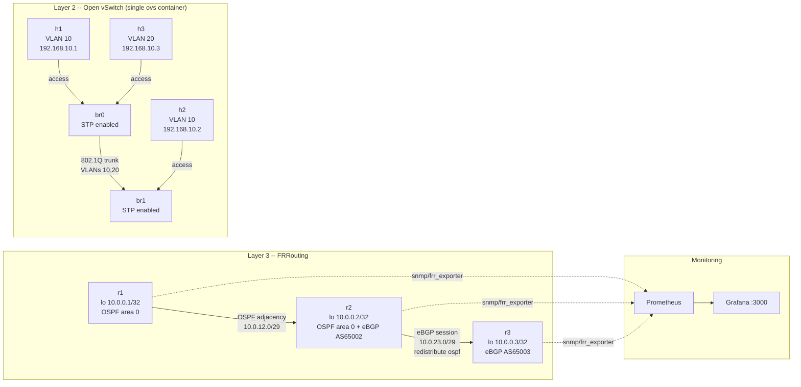

# Topology

- **r1 <-> r2**: OSPF full adjacency over a point-to-point Docker network.
  Both routers advertise their loopback into area 0.
- **r2 <-> r3**: eBGP session (AS 65002 <-> AS 65003). r2 redistributes its
  OSPF-learned routes into BGP, so r3 learns r1's loopback without ever
  running OSPF itself — a genuine inter-domain redistribution boundary, not
  two protocols glued together for show.
- **br0 <-> br1**: an 802.1Q trunk between two Open vSwitch bridges carrying
  VLANs 10 and 20. `h1`/`h2` (VLAN 10) reach each other across the trunk;
  `h3` (VLAN 20, same switch and same IP subnet as `h1`) cannot reach either,
  proven by ARP-level isolation, not a routing failure.
- **Monitoring**: `snmp_exporter` polls each router's `snmpd` for interface
  counters; `frr_exporter` reads each router's vtysh unix sockets directly
  for OSPF/BGP protocol state. Both feed Prometheus, visualized in Grafana.
